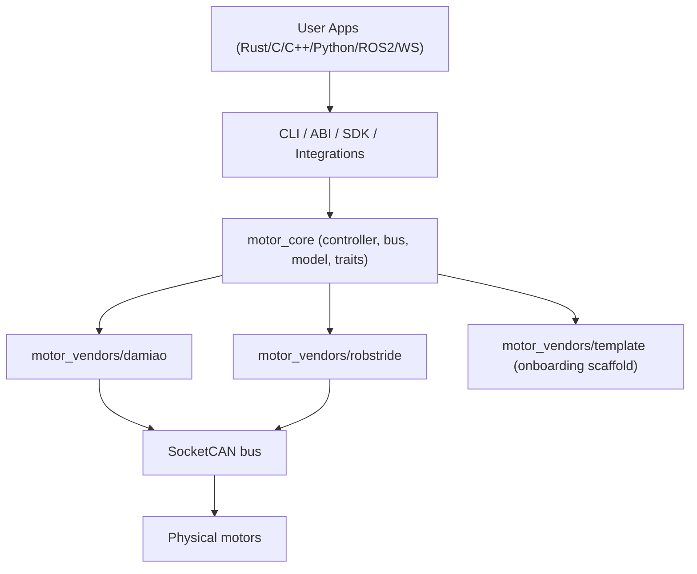
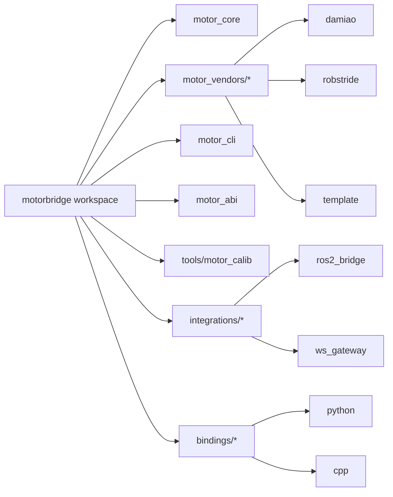

# motorbridge

Unified CAN motor control stack with a vendor-agnostic Rust core, stable C ABI, and Python/C++ bindings.

> Chinese version: [README.zh-CN.md](README.zh-CN.md)

## Current Vendor Support

- Damiao:
  - models: `3507`, `4310`, `4310P`, `4340`, `4340P`, `6006`, `8006`, `8009`, `10010L`, `10010`, `H3510`, `G6215`, `H6220`, `JH11`, `6248P`
  - modes: `scan`, `MIT`, `POS_VEL`, `VEL`, `FORCE_POS`
- RobStride:
  - models: `rs-00`, `rs-01`, `rs-02`, `rs-03`, `rs-04`, `rs-05`, `rs-06`
  - modes: `scan`, `scan-manual`, `ping`, `MIT`, `VEL`, parameter read/write

## Architecture

### Layered Runtime View



### Workspace Topology (Latest)



- [`motor_core`](motor_core): vendor-agnostic controller, routing, SocketCAN bus layer
- [`motor_vendors/damiao`](motor_vendors/damiao): Damiao protocol / models / registers
- [`motor_vendors/robstride`](motor_vendors/robstride): RobStride extended CAN protocol / models / parameters
- [`motor_cli`](motor_cli): unified Rust CLI
- [`motor_abi`](motor_abi): stable C ABI
- [`bindings/python`](bindings/python): Python SDK + `motorbridge-cli`
- [`bindings/cpp`](bindings/cpp): C++ RAII wrapper

## Quick Start

Build:

```bash
cargo build
```

Bring up CAN:

```bash
sudo ip link set can0 down 2>/dev/null || true
sudo ip link set can0 type can bitrate 1000000 restart-ms 100
sudo ip link set can0 up
ip -details link show can0
```

Quick CAN restart (Linux):

```bash
# default: can0 / 1Mbps / restart-ms=100 / loopback off
IF=can0; BITRATE=1000000; RESTART_MS=100; LOOPBACK=off
sudo ip link set "$IF" down 2>/dev/null || true
if [ "$LOOPBACK" = "on" ]; then
  sudo ip link set "$IF" type can bitrate "$BITRATE" restart-ms "$RESTART_MS" loopback on
else
  sudo ip link set "$IF" type can bitrate "$BITRATE" restart-ms "$RESTART_MS" loopback off
fi
sudo ip link set "$IF" up
ip -details link show "$IF"
```

Damiao CLI:

```bash
cargo run -p motor_cli --release -- \
  --vendor damiao --channel can0 --model 4340P --motor-id 0x01 --feedback-id 0x11 \
  --mode mit --pos 0 --vel 0 --kp 20 --kd 1 --tau 0 --loop 50 --dt-ms 20
```

RobStride CLI:

```bash
cargo run -p motor_cli --release -- \
  --vendor robstride --channel can0 --model rs-00 --motor-id 127 \
  --mode vel --vel 0.3 --loop 40 --dt-ms 50
```

RobStride CLI parameter read:

```bash
cargo run -p motor_cli --release -- \
  --vendor robstride --channel can0 --model rs-00 --motor-id 127 \
  --mode read-param --param-id 0x7019
```

Unified scan (both vendors):

```bash
cargo run -p motor_cli --release -- \
  --vendor all --channel can0 --mode scan --start-id 1 --end-id 255
```

Interpretation:

- `vendor=damiao id=<n>` means one Damiao motor is online at motor ID `<n>`.
- `vendor=robstride id=<n> responder_id=<m>` means one RobStride motor responded.
- `hits=<k>` at the end of each scan block is the count of discovered devices.

## ABI and Bindings

- C ABI:
  - Damiao: `motor_controller_add_damiao_motor(...)`
  - RobStride: `motor_controller_add_robstride_motor(...)`
- Python:
  - `Controller.add_damiao_motor(...)`
  - `Controller.add_robstride_motor(...)`
- C++:
  - `Controller::add_damiao_motor(...)`
  - `Controller::add_robstride_motor(...)`

RobStride-specific ABI/binding helpers include:

- `robstride_ping`
- `robstride_get_param_*`
- `robstride_write_param_*`

## Example Entry Points

- Cross-language index: `examples/README.md`
- C ABI demo: `examples/c/c_abi_demo.c`
- C++ ABI demo: `examples/cpp/cpp_abi_demo.cpp`
- Python ctypes demo: `examples/python/python_ctypes_demo.py`
- Python SDK docs: `bindings/python/README.md`
- C++ binding docs: `bindings/cpp/README.md`

## Release Assets Guide

- For C/C++ on Ubuntu x86_64:
  - Download `motorbridge-abi-<tag>-linux-x86_64.deb`
  - Install: `sudo apt install ./motorbridge-abi-<tag>-linux-x86_64.deb`
- For C/C++ on other targets:
  - Use ABI archives (`motorbridge-abi-<tag>-linux-*.tar.gz` or `windows-*.zip`)
  - Link against `libmotor_abi` and use headers/CMake config from the package.
- For Python:
  - Download the matching wheel (`cp310/cp311/cp312` + correct platform/arch)
  - Install: `pip install ./motorbridge-*.whl`
  - Or use source package: `pip install ./motorbridge-*.tar.gz`
- Device matrix: `docs/en/devices.md`
