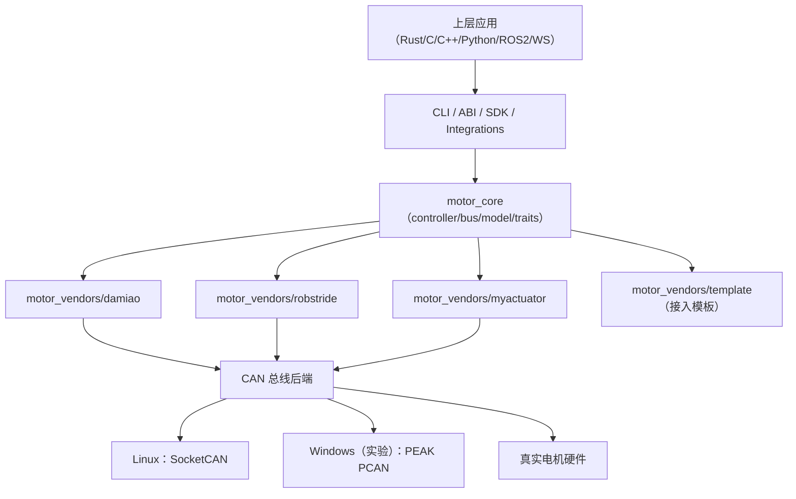
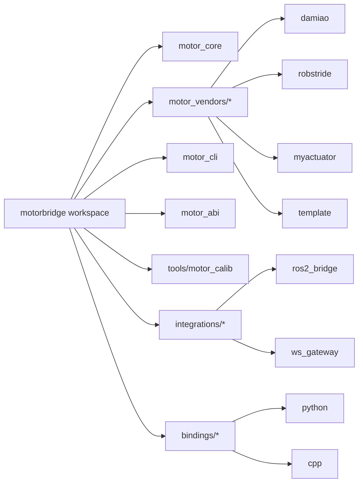

# motorbridge

这是一个统一的 CAN 电机控制栈，包含 vendor-agnostic Rust core、稳定 C ABI，以及 Python/C++ bindings。

> English version: [README.md](README.md)

## 当前支持的厂商

- Damiao:
  - 型号: `3507`, `4310`, `4310P`, `4340`, `4340P`, `6006`, `8006`, `8009`, `10010L`, `10010`, `H3510`, `G6215`, `H6220`, `JH11`, `6248P`
  - 模式: `scan`, `MIT`, `POS_VEL`, `VEL`, `FORCE_POS`
- RobStride:
  - 型号: `rs-00`, `rs-01`, `rs-02`, `rs-03`, `rs-04`, `rs-05`, `rs-06`
  - 模式: `scan`, `ping`, `MIT`, `VEL`, 参数读写
- MyActuator:
  - 型号: `X8`（运行时字符串，协议按 ID 通信）
  - 模式: `scan`, `enable`, `disable`, `stop`, `set-zero`, `status`, `current`, `vel`, `pos`, `version`, `mode-query`
- HighTorque:
  - 型号: `hightorque`（运行时字符串，原生 `ht_can v1.5.5`）
  - 模式: `scan`, `read`, `mit`, `pos-vel`, `vel`, `stop`, `brake`, `rezero`

## 架构

### 分层运行时视图



### 工作区拓扑（最新版）



- [`motor_core`](motor_core): 与厂商无关的控制器、路由、CAN 总线层（Linux SocketCAN / Windows 实验性 PCAN）
- [`motor_vendors/damiao`](motor_vendors/damiao): Damiao 协议 / 型号 / 寄存器
- [`motor_vendors/robstride`](motor_vendors/robstride): RobStride 扩展 CAN 协议 / 型号 / 参数
- [`motor_vendors/myactuator`](motor_vendors/myactuator): MyActuator CAN 协议实现
- [`motor_cli`](motor_cli): 统一 Rust CLI
  - 全参数英文文档: [`motor_cli/README.md`](motor_cli/README.md)
  - 全参数中文文档: [`motor_cli/README.zh-CN.md`](motor_cli/README.zh-CN.md)
  - Damiao 指令/寄存器文档: [`motor_cli/DAMIAO_API.md`](motor_cli/DAMIAO_API.md), [`motor_cli/DAMIAO_API.zh-CN.md`](motor_cli/DAMIAO_API.zh-CN.md)
  - RobStride 指令/参数文档: [`motor_cli/ROBSTRIDE_API.md`](motor_cli/ROBSTRIDE_API.md), [`motor_cli/ROBSTRIDE_API.zh-CN.md`](motor_cli/ROBSTRIDE_API.zh-CN.md)
  - MyActuator 指令/模式文档: [`motor_cli/MYACTUATOR_API.md`](motor_cli/MYACTUATOR_API.md), [`motor_cli/MYACTUATOR_API.zh-CN.md`](motor_cli/MYACTUATOR_API.zh-CN.md)
- [`motor_abi`](motor_abi): 稳定 C ABI
- [`bindings/python`](bindings/python): Python SDK + `motorbridge-cli`
- [`bindings/cpp`](bindings/cpp): C++ RAII wrapper

## 快速开始

构建:

```bash
cargo build
```

拉起 CAN:

```bash
sudo ip link set can0 down 2>/dev/null || true
sudo ip link set can0 type can bitrate 1000000 restart-ms 100
sudo ip link set can0 up
ip -details link show can0
```

Linux 下快速重启 CAN：

```bash
# 默认：can0 / 1Mbps / restart-ms=100 / loopback 关闭
IF=can0; BITRATE=1000000; RESTART_MS=100; LOOPBACK=off
sudo ip link set "$IF" down 2>/dev/null || true
if [ "$LOOPBACK" = "on" ]; then
  sudo ip link set "$IF" type can bitrate "$BITRATE" restart-ms "$RESTART_MS" loopback on
else
  sudo ip link set "$IF" type can bitrate "$BITRATE" restart-ms "$RESTART_MS" loopback off
fi
sudo ip link set "$IF" up
ip -details link show "$IF"
```

Damiao CLI:

```bash
cargo run -p motor_cli --release -- \
  --vendor damiao --channel can0 --model 4340P --motor-id 0x01 --feedback-id 0x11 \
  --mode mit --pos 0 --vel 0 --kp 20 --kd 1 --tau 0 --loop 50 --dt-ms 20
```

RobStride CLI:

```bash
cargo run -p motor_cli --release -- \
  --vendor robstride --channel can0 --model rs-00 --motor-id 127 \
  --mode vel --vel 0.3 --loop 40 --dt-ms 50
```

RobStride CLI 读参数:

```bash
cargo run -p motor_cli --release -- \
  --vendor robstride --channel can0 --model rs-00 --motor-id 127 \
  --mode read-param --param-id 0x7019
```

HighTorque CLI（原生 ht_can v1.5.5）:

```bash
cargo run -p motor_cli --release -- \
  --vendor hightorque --channel can0 --model hightorque --motor-id 1 \
  --mode read
```

MyActuator CLI:

```bash
cargo run -p motor_cli --release -- \
  --vendor myactuator --channel can0 --model X8 --motor-id 1 --feedback-id 0x241 \
  --mode status --loop 20 --dt-ms 50
```

统一全品牌扫描:

```bash
cargo run -p motor_cli --release -- \
  --vendor all --channel can0 --mode scan --start-id 1 --end-id 255
```

## Windows 实验支持（PCAN-USB）

项目主线仍以 Linux 为主。Windows 支持为实验性能力，当前通过 PEAK PCAN 后端实现。

- 在 Windows 安装 PEAK 驱动与 PCAN-Basic 运行时（`PCANBasic.dll`）。
- 通道映射：
  - `can0` -> `PCAN_USBBUS1`
  - `can1` -> `PCAN_USBBUS2`
- 可选波特率后缀：`@<bitrate>`，例如 `can0@1000000`。

Windows 验证命令：

```bash
# 扫描 Damiao 电机 ID
cargo run -p motor_cli --release -- --vendor damiao --channel can0@1000000 --model 4340P --motor-id 0x01 --feedback-id 0x11 --mode scan --start-id 1 --end-id 16

# 1 号电机（4340P）转到 +pi 弧度（约 180 度）
cargo run -p motor_cli --release -- --vendor damiao --channel can0@1000000 --model 4340P --motor-id 0x01 --feedback-id 0x11 --mode pos-vel --pos 3.1416 --vlim 2.0 --loop 1 --dt-ms 20

# 7 号电机（4310）转到 +pi 弧度（约 180 度）
cargo run -p motor_cli --release -- --vendor damiao --channel can0@1000000 --model 4310 --motor-id 0x07 --feedback-id 0x17 --mode pos-vel --pos 3.1416 --vlim 2.0 --loop 1 --dt-ms 20
```

## Linux USB-CAN（`slcan`）速查

Linux 下直接使用 SocketCAN 网卡名（例如 `can0`、`slcan0`）。
不要在 Linux 的通道名里加波特率后缀（例如 `can0@1000000` 在 Linux SocketCAN 下无效）。

把 `slcan` 适配器挂成 `slcan0`：

```bash
sudo slcand -o -c -s8 /dev/ttyUSB0 slcan0
sudo ip link set slcan0 up
ip -details link show slcan0
```

之后在 CLI 里直接使用 `slcan0`：

```bash
cargo run -p motor_cli --release -- --vendor damiao --channel slcan0 --mode scan --start-id 1 --end-id 255
```

## CAN 专业调试手册

如需系统化排查 Linux `slcan` 与 Windows `pcan`，请直接使用：

- [`docs/zh/can_debugging.md`](docs/zh/can_debugging.md)
- [`docs/en/can_debugging.md`](docs/en/can_debugging.md)

结果解读：

- `vendor=damiao id=<n>`：发现一个 Damiao 电机，电机 ID 为 `<n>`。
- `vendor=robstride id=<n> responder_id=<m>`：发现一个 RobStride 电机并返回响应 ID。
- `vendor=hightorque ... [hit] id=<n> ...`：通过原生 ht_can v1.5.5 发现一个 HighTorque 电机。
- `vendor=myactuator id=<n>`：发现一个 MyActuator 电机并返回版本响应。
- 每段扫描结尾的 `hits=<k>` 表示该厂商命中的在线设备数量。

## ABI 与绑定

- C ABI:
  - Damiao: `motor_controller_add_damiao_motor(...)`
  - RobStride: `motor_controller_add_robstride_motor(...)`
  - MyActuator: `motor_controller_add_myactuator_motor(...)`
  - HighTorque: `motor_controller_add_hightorque_motor(...)`
- Python:
  - `Controller.add_damiao_motor(...)`
  - `Controller.add_robstride_motor(...)`
  - `Controller.add_myactuator_motor(...)`
  - `Controller.add_hightorque_motor(...)`
- C++:
  - `Controller::add_damiao_motor(...)`
  - `Controller::add_robstride_motor(...)`
  - `Controller::add_myactuator_motor(...)`
  - `Controller::add_hightorque_motor(...)`

ABI/绑定中的统一模式 ID（`ensure_mode`）：

- `1 = MIT`
- `2 = POS_VEL`
- `3 = VEL`
- `4 = FORCE_POS`

统一控制单位：

- 位置：`rad`
- 速度：`rad/s`
- 力矩：`Nm`

各厂商协议原生模式名映射与不支持项详见：

- [`docs/en/abi.md`](docs/en/abi.md)
- [`docs/zh/abi.md`](docs/zh/abi.md)

RobStride 专属 ABI / binding 能力包括:

- `robstride_ping`
- `robstride_get_param_*`
- `robstride_write_param_*`

## 示例入口

- 跨语言索引: `examples/README.md`
- C ABI 示例: `examples/c/c_abi_demo.c`
- C++ ABI 示例: `examples/cpp/cpp_abi_demo.cpp`
- Python ctypes 示例: `examples/python/python_ctypes_demo.py`
- Python SDK 文档: `bindings/python/README.md`
- C++ binding 文档: `bindings/cpp/README.md`

## Release 资产使用指南

- Ubuntu x86_64 上做 C/C++ 开发：
  - 下载 `motorbridge-abi-<tag>-linux-x86_64.deb`
  - 安装：`sudo apt install ./motorbridge-abi-<tag>-linux-x86_64.deb`
- Windows x86_64 上做 C/C++ 开发：
  - 下载 `motorbridge-abi-<tag>-windows-x86_64.zip`
  - 解压后链接 `motor_abi.dll/.lib`，并使用包内头文件/CMake 配置
- 其他平台的 C/C++ 开发：
  - 使用 ABI 压缩包（`motorbridge-abi-<tag>-linux-*.tar.gz` 或 `windows-*.zip`）
  - 从包内 include/lib 链接 `libmotor_abi`。
- Python 开发：
  - 下载匹配解释器与平台的 wheel（`cp310/cp311/cp312` + 对应 arch）
  - 安装：`pip install ./motorbridge-*.whl`
  - 或安装源码包：`pip install ./motorbridge-*.tar.gz`
- 说明：
  - `.deb` 仅用于 Linux；Windows 请使用 `.zip` 和 `.whl`。
- 设备矩阵: `docs/zh/devices.md`
