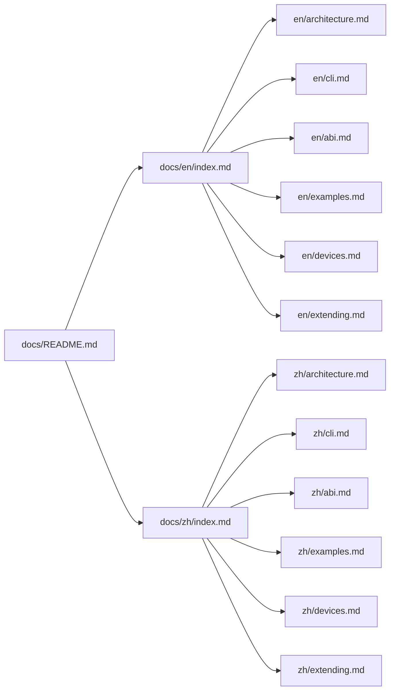

# Documentation Hub

- English: [en/index.md](en/index.md)
- 中文: [zh/index.md](zh/index.md)

The bilingual docs under `docs/en` and `docs/zh` are the only maintained documentation structure.

## Docs Map

