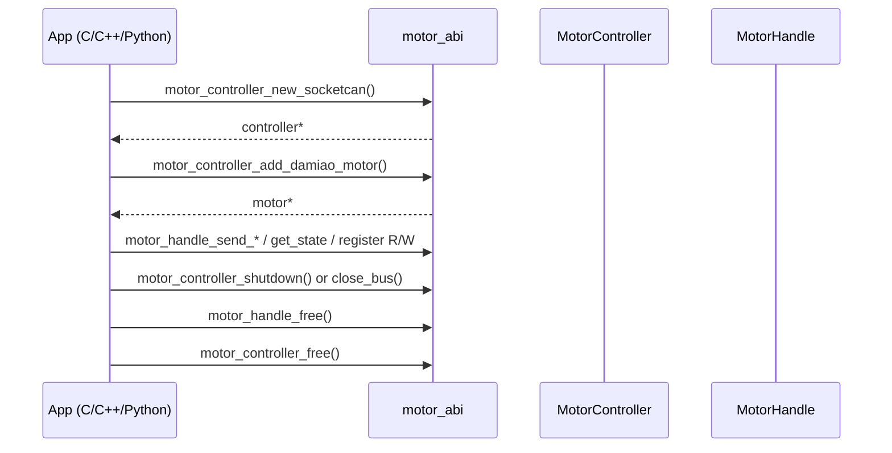
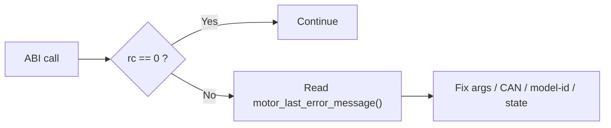

# ABI Guide (`motor_abi`)

## ABI Lifecycle Sequence



## Error Handling Path



## Build

```bash
cargo build -p motor_abi --release
```

Outputs:

- Linux: `target/release/libmotor_abi.so`, `libmotor_abi.a`
- macOS: `target/release/libmotor_abi.dylib`, `libmotor_abi.a`
- Windows: `target/release/motor_abi.dll`, `motor_abi.lib`

Header:

- `motor_abi/include/motor_abi.h`

Scope:

- Current ABI vendor entry is Damiao (`motor_controller_add_damiao_motor`).
- ABI surface is vendor-agnostic in shape and can be extended with additional vendor add-functions.

## Return Code Convention

- `0` = success
- `-1` = failure
- error string from `motor_last_error_message()`

## Controller APIs

- `motor_controller_new_socketcan`
- `motor_controller_poll_feedback_once`
- `motor_controller_enable_all`
- `motor_controller_disable_all`
- `motor_controller_shutdown`
- `motor_controller_close_bus`
- `motor_controller_free`

## Motor Handle APIs (Complete List)

Lifecycle:

- `motor_controller_add_damiao_motor`
- `motor_handle_free`

Control and mode:

- `motor_handle_enable`
- `motor_handle_disable`
- `motor_handle_clear_error`
- `motor_handle_set_zero_position`
- `motor_handle_ensure_mode`

Command send:

- `motor_handle_send_mit`
- `motor_handle_send_pos_vel`
- `motor_handle_send_vel`
- `motor_handle_send_force_pos`

Maintenance and state:

- `motor_handle_store_parameters`
- `motor_handle_request_feedback`
- `motor_handle_set_can_timeout_ms`
- `motor_handle_get_state`

Register access:

- `motor_handle_write_register_f32`
- `motor_handle_write_register_u32`
- `motor_handle_get_register_f32`
- `motor_handle_get_register_u32`

Lifecycle recommendation:

- Use `shutdown` for explicit stop/disable workflows.
- Use `close_bus` for query/scan/id-tooling sessions where implicit shutdown is undesirable.
- Then call `free` to release resources.

## Mode Values

For `motor_handle_ensure_mode(motor, mode, timeout_ms)`:

- `1 = MIT`
- `2 = POS_VEL`
- `3 = VEL`
- `4 = FORCE_POS`

## C/C++/Python References

- C example: `examples/c/c_abi_demo.c`
- C++ example: `examples/cpp/cpp_abi_demo.cpp`
- Python ctypes example: `examples/python/python_ctypes_demo.py`
- Python SDK wrapper: `bindings/python`
- C++ RAII wrapper: `bindings/cpp`

## Integration Mapping

- `integrations/ws_gateway` (Rust) now exposes ABI-equivalent operation surface over WebSocket V1 command API.
- `integrations/ros2_bridge` exposes control/calibration operations via ROS2 topics.

## Recommended Call Flow

1. `motor_controller_new_socketcan`
2. `motor_controller_add_damiao_motor`
3. optional: `motor_controller_enable_all`
4. optional: `motor_handle_ensure_mode`
5. send commands / read state / register operations
6. end session:
   - use `motor_controller_shutdown` for explicit stop/disable lifecycle, or
   - use `motor_controller_close_bus` for non-shutdown tooling sessions
7. release handles: `motor_handle_free` then `motor_controller_free`
