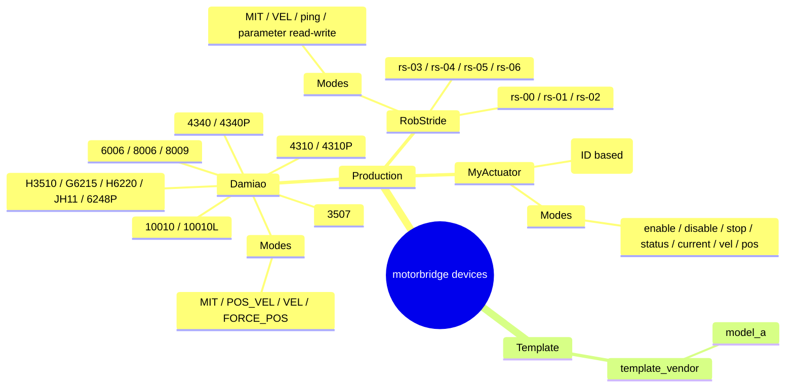

# Supported Devices

## Support Landscape

## Production Support

| Brand | Models | Control Modes | Register R/W | ABI Coverage | Notes |
|---|---|---|---|---|---|
| Damiao | 3507, 4310, 4310P, 4340, 4340P, 6006, 8006, 8009, 10010L, 10010, H3510, G6215, H6220, JH11, 6248P | MIT, POS_VEL, VEL, FORCE_POS | Yes (f32/u32) | Yes | Run per-model hardware regression |
| RobStride | rs-00, rs-01, rs-02, rs-03, rs-04, rs-05, rs-06 | MIT, VEL, parameter read/write, ping | Yes (i8/u8/u16/u32/f32) | No | Uses 29-bit extended CAN IDs; verified on can0 with device 127 |
| MyActuator | X-series (runtime model string, default `X8`) | enable, disable, stop, status, current, vel, pos, version, mode-query | No (CLI command-level support) | No | Uses standard 11-bit IDs `0x140+id` / `0x240+id`; practical ID range 1..32 |

## Template (Not Production)

| Brand | Models | Control Modes | Register R/W | ABI Coverage | Notes |
|---|---|---|---|---|---|
| template_vendor | model_a (placeholder) | Placeholder only | Placeholder only | No | Scaffolding for new vendor integration |

## Mode Legend

- MIT: position + velocity + stiffness + damping + torque feedforward
- POS_VEL: position + velocity limit
- VEL: velocity control
- FORCE_POS: position + velocity limit + torque ratio
