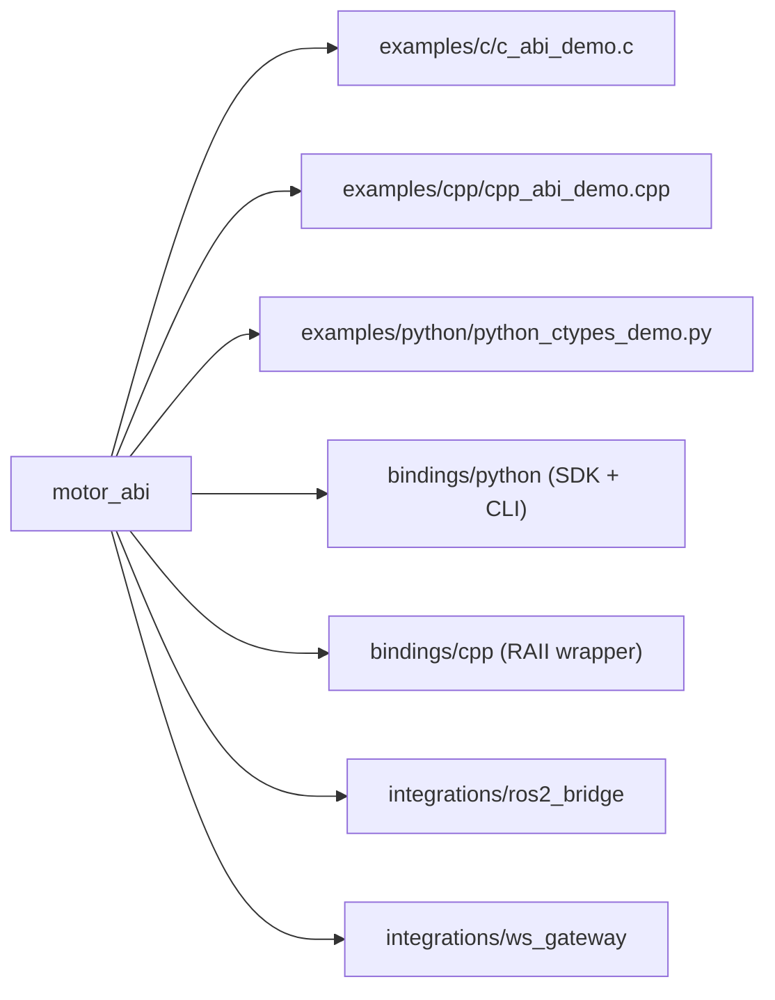

# Cross-language Examples

## Example Coverage Map



## Example Index

- Rust CLI: `motor_cli/src/main.rs`
- Rust vendor demos:
  - `motor_vendors/damiao/examples/test_4340.rs`
  - `motor_vendors/damiao/examples/test_4340p.rs`
- C ABI: `examples/c/c_abi_demo.c`
- C++ ABI: `examples/cpp/cpp_abi_demo.cpp`
- C++ wrapper package: `bindings/cpp`
- Python ctypes ABI: `examples/python/python_ctypes_demo.py`
- Python SDK package: `bindings/python`
- ROS2 bridge: `integrations/ros2_bridge`
- WebSocket gateway: `integrations/ws_gateway`

## Run C Example

```bash
cargo build -p motor_abi --release
cc examples/c/c_abi_demo.c -I motor_abi/include -L target/release -lmotor_abi -o c_abi_demo
LD_LIBRARY_PATH=target/release ./c_abi_demo can0 4340P 0x01 0x11
```

## Run C++ Example

```bash
cargo build -p motor_abi --release
g++ -std=c++17 examples/cpp/cpp_abi_demo.cpp -I motor_abi/include -L target/release -lmotor_abi -o cpp_abi_demo
LD_LIBRARY_PATH=target/release ./cpp_abi_demo can0 4340P 0x01 0x11
```

## Run Python ctypes Example

```bash
cargo build -p motor_abi --release
python3 examples/python/python_ctypes_demo.py --channel can0 --model 4340P --motor-id 0x01 --feedback-id 0x11
```

## Run Python SDK CLI

```bash
PYTHONPATH=bindings/python/src python3 -m motorbridge.cli --help
PYTHONPATH=bindings/python/src python3 -m motorbridge.cli run --help
PYTHONPATH=bindings/python/src python3 -m motorbridge.cli id-dump --help
PYTHONPATH=bindings/python/src python3 -m motorbridge.cli id-set --help
PYTHONPATH=bindings/python/src python3 -m motorbridge.cli scan --help
```
