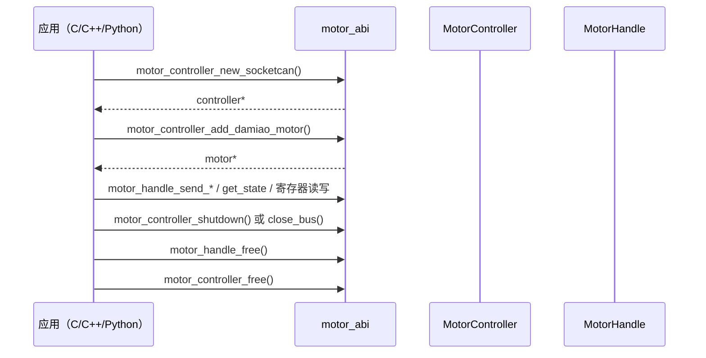
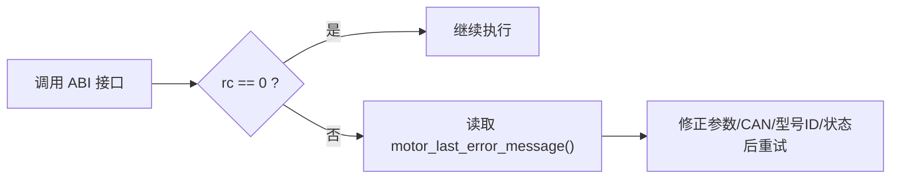

# ABI 接口指南（`motor_abi`）

## ABI 生命周期时序



## 错误处理路径



## 构建

```bash
cargo build -p motor_abi --release
```

产物：

- Linux：`target/release/libmotor_abi.so`、`libmotor_abi.a`
- macOS：`target/release/libmotor_abi.dylib`、`libmotor_abi.a`
- Windows：`target/release/motor_abi.dll`、`motor_abi.lib`

头文件：

- `motor_abi/include/motor_abi.h`

范围说明：

- 当前 ABI 厂商接入入口为 Damiao（`motor_controller_add_damiao_motor`）。
- ABI 形态本身是可扩展的，后续可增加其他厂商 `add_motor` 入口函数。

## 返回值约定

- `0`：成功
- `-1`：失败
- 失败信息通过 `motor_last_error_message()` 获取

## 控制器接口

- `motor_controller_new_socketcan`
- `motor_controller_poll_feedback_once`
- `motor_controller_enable_all`
- `motor_controller_disable_all`
- `motor_controller_shutdown`
- `motor_controller_close_bus`
- `motor_controller_free`

## 电机句柄接口（完整清单）

生命周期：

- `motor_controller_add_damiao_motor`
- `motor_handle_free`

控制与模式：

- `motor_handle_enable`
- `motor_handle_disable`
- `motor_handle_clear_error`
- `motor_handle_set_zero_position`
- `motor_handle_ensure_mode`

指令发送：

- `motor_handle_send_mit`
- `motor_handle_send_pos_vel`
- `motor_handle_send_vel`
- `motor_handle_send_force_pos`

运维与状态：

- `motor_handle_store_parameters`
- `motor_handle_request_feedback`
- `motor_handle_set_can_timeout_ms`
- `motor_handle_get_state`

寄存器访问：

- `motor_handle_write_register_f32`
- `motor_handle_write_register_u32`
- `motor_handle_get_register_f32`
- `motor_handle_get_register_u32`

生命周期建议：

- 需要明确停止/失能流程：使用 `shutdown`
- 扫描/查询/改 ID 等不想触发隐式失能：使用 `close_bus`
- 最后统一 `free` 释放资源

## 模式值

`motor_handle_ensure_mode(motor, mode, timeout_ms)` 的 `mode`：

- `1 = MIT`
- `2 = POS_VEL`
- `3 = VEL`
- `4 = FORCE_POS`

## 跨语言参考

- C 示例：`examples/c/c_abi_demo.c`
- C++ 示例：`examples/cpp/cpp_abi_demo.cpp`
- Python ctypes 示例：`examples/python/python_ctypes_demo.py`
- Python SDK 封装：`bindings/python`
- C++ RAII 封装：`bindings/cpp`

## 集成映射

- `integrations/ws_gateway`（Rust）已通过 WebSocket V1 命令层暴露与 ABI 等价的操作面。
- `integrations/ros2_bridge` 通过 ROS2 topics 暴露控制/标定能力。

## 推荐调用流程

1. `motor_controller_new_socketcan`
2. `motor_controller_add_damiao_motor`
3. 可选：`motor_controller_enable_all`
4. 可选：`motor_handle_ensure_mode`
5. 执行控制/状态读取/寄存器操作
6. 会话结束：
   - 需要明确停止/失能时，用 `motor_controller_shutdown`
   - 标定/查询类会话，用 `motor_controller_close_bus`
7. 释放资源：`motor_handle_free` 后 `motor_controller_free`
