# 支持设备

<!-- channel-compat-note -->
## 通道兼容说明（PCAN + slcan + Damiao 串口桥）

- Linux SocketCAN 直接使用网卡名：`can0`、`can1`、`slcan0`。
- 串口类 USB-CAN 需先创建并拉起 `slcan0`：`sudo slcand -o -c -s8 /dev/ttyUSB0 slcan0 && sudo ip link set slcan0 up`。
- 仅 Damiao 可选串口桥链路：`--transport dm-serial --serial-port /dev/ttyACM0 --serial-baud 921600`。
- Linux SocketCAN 下 `--channel` 不要带 `@bitrate`（例如 `can0@1000000` 无效）。
- Windows（PCAN 后端）中，`can0/can1` 映射 `PCAN_USBBUS1/2`，可选 `@bitrate` 后缀。

## 设备支持全景图

```mermaid
mindmap
  root((motorbridge 设备))
    生产支持
      Damiao
        3507
        4310 / 4310P
        4340 / 4340P
        6006 / 8006 / 8009
        10010 / 10010L
        H3510 / G6215 / H6220 / JH11 / 6248P
        模式
          MIT / POS_VEL / VEL / FORCE_POS
      RobStride
        rs-00 / rs-01 / rs-02
        rs-03 / rs-04 / rs-05 / rs-06
        模式
          MIT / POS_VEL / VEL / ping / enable-disable / 参数读写 / set-id / zero
      MyActuator
        X 系列（按 ID 通信）
        模式
          enable / disable / stop / status / current / vel / pos
      HighTorque
        hightorque（原生 ht_can v1.5.5）
        模式
          scan / read / mit / pos-vel / vel / stop
    模板
      template_vendor
        model_a
```

## 生产可用支持

| 品牌 | 型号 | 控制模式 | 寄存器读写 | ABI 覆盖 | 说明 |
|---|---|---|---|---|---|
| Damiao | 3507, 4310, 4310P, 4340, 4340P, 6006, 8006, 8009, 10010L, 10010, H3510, G6215, H6220, JH11, 6248P | MIT, POS_VEL, VEL, FORCE_POS | 支持（f32/u32） | 支持 | 建议按型号实机回归 |
| RobStride | rs-00, rs-01, rs-02, rs-03, rs-04, rs-05, rs-06 | scan / ping / enable / disable / MIT / POS_VEL / VEL / read-param / write-param / set-id / zero | 支持（i8/u8/u16/u32/f32） | 支持 | 使用 29-bit 扩展 CAN ID；默认 `feedback-id=0xFD`，并回退探测 `0xFF/0xFE` |
| MyActuator | X 系列（运行时型号字符串，默认 `X8`） | enable、disable、stop、status、current、vel、pos、version、mode-query | 暂无（CLI 命令级支持） | 支持 | 使用标准 11-bit ID：`0x140+id` / `0x240+id`；常用 ID 范围 1..32 |
| HighTorque | hightorque（运行时型号字符串；原生 `ht_can v1.5.5`） | scan、read、MIT、POS_VEL、VEL、stop、brake、rezero | 暂无（vendor 命令级支持） | 支持 | 对外统一 `rad/rad/s/Nm`，原生 payload 缩放由实现层处理 |

## 模板（非生产）

| 品牌 | 型号 | 控制模式 | 寄存器读写 | ABI 覆盖 | 说明 |
|---|---|---|---|---|---|
| template_vendor | model_a（占位） | 占位实现 | 占位实现 | 不支持 | 用于新厂商接入模板 |

## 模式说明

- MIT：位置 + 速度 + 刚度 + 阻尼 + 力矩前馈
- POS_VEL：位置 + 速度限制
- VEL：速度控制
- FORCE_POS：位置 + 速度限制 + 力矩比例

## Update (2026-04): Damiao / RobStride Capability Matrix

| 品牌 | 核心能力状态 | 已验证能力 | 备注 |
|---|---|---|---|
| Damiao | 生产可用 | scan / enable / disable / MIT / POS_VEL / VEL / FORCE_POS / set-id / set-zero | 改 ID 建议始终使用 `--store 1 --verify-id 1` |
| RobStride | 生产可用 | scan / ping / enable / disable / MIT / POS_VEL / VEL / read-param / write-param / set-id / zero | 默认 `feedback-id=0xFD`，并回退探测 `0xFF/0xFE`；`pos-vel` 忽略 `--vel/--kd/--tau`（warning，不报错） |

