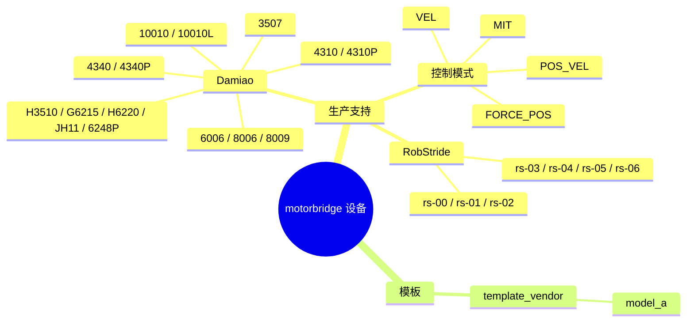

# 支持设备

## 设备支持全景图

## 生产可用支持

| 品牌 | 型号 | 控制模式 | 寄存器读写 | ABI 覆盖 | 说明 |
|---|---|---|---|---|---|
| Damiao | 3507, 4310, 4310P, 4340, 4340P, 6006, 8006, 8009, 10010L, 10010, H3510, G6215, H6220, JH11, 6248P | MIT, POS_VEL, VEL, FORCE_POS | 支持（f32/u32） | 支持 | 建议按型号实机回归 |
| RobStride | rs-00, rs-01, rs-02, rs-03, rs-04, rs-05, rs-06 | MIT、VEL、参数读写、ping | 支持（i8/u8/u16/u32/f32） | 不支持 | 使用 29-bit 扩展 CAN ID；已在 can0 上对设备 127 做过实机验证 |

## 模板（非生产）

| 品牌 | 型号 | 控制模式 | 寄存器读写 | ABI 覆盖 | 说明 |
|---|---|---|---|---|---|
| template_vendor | model_a（占位） | 占位实现 | 占位实现 | 不支持 | 用于新厂商接入模板 |

## 模式说明

- MIT：位置 + 速度 + 刚度 + 阻尼 + 力矩前馈
- POS_VEL：位置 + 速度限制
- VEL：速度控制
- FORCE_POS：位置 + 速度限制 + 力矩比例
