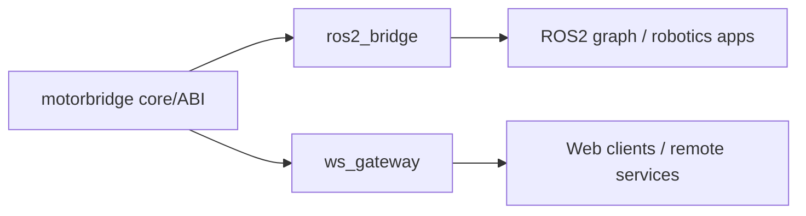

# Integrations

Production-oriented bridge adapters live here.

- `ros2_bridge/`: ROS2 integration (implemented)
- `ws_gateway/`: Rust WebSocket gateway (implemented, V1 JSON over WS)

## Experimental Windows Support (PCAN-USB)

Linux remains the primary target. Windows support is experimental and currently uses PEAK PCAN.

- Install PEAK PCAN driver + PCAN-Basic runtime (`PCANBasic.dll`).
- Use `can0@1000000` for Windows channel+bitrate in CLI/gateway commands.
