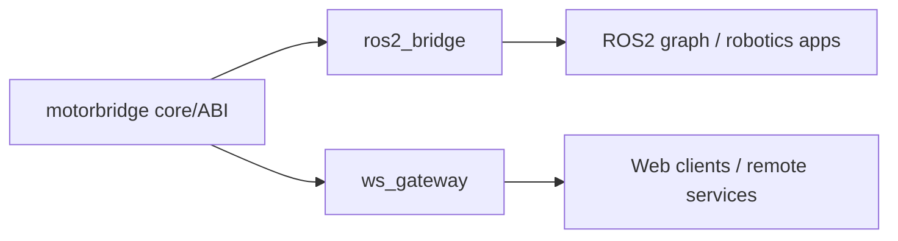

# Integrations

Production-oriented bridge adapters live here.

```mermaid
flowchart LR
  CORE["motorbridge core/ABI"] --> ROS["ros2_bridge"]
  CORE --> WS["ws_gateway"]
  ROS --> ROBOT["ROS2 graph / robotics apps"]
  WS --> WEB["Web clients / remote services"]
```

- `ros2_bridge/`: ROS2 integration (implemented)
- `ws_gateway/`: Rust WebSocket gateway (implemented, V1 JSON over WS)
