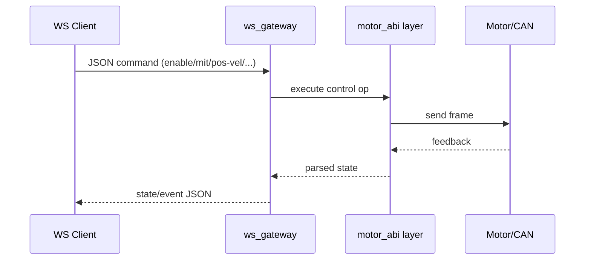

# ws_gateway

<!-- channel-compat-note -->
## Channel Compatibility (PCAN + slcan + Damiao Serial Bridge)

- Linux SocketCAN uses interface names directly: `can0`, `can1`, `slcan0`.
- For USB-serial CAN adapters, bring up `slcan0` first: `sudo slcand -o -c -s8 /dev/ttyUSB0 slcan0 && sudo ip link set slcan0 up`.
- Damiao-only serial bridge transport is also available in CLI (`--transport dm-serial --serial-port /dev/ttyACM0 --serial-baud 921600`).
- Full Damiao serial-bridge interface list and command patterns are documented in `motor_cli/README.md` (section `3.6` in `motor_cli/README.zh-CN.md`).
- On Linux SocketCAN, do not append bitrate in `--channel` (for example `can0@1000000` is invalid).
- On Windows (PCAN backend), `can0/can1` map to `PCAN_USBBUS1/2`; optional `@bitrate` suffix is supported.


High-performance Rust WebSocket gateway (V1: JSON over WS).



## Status

Core WS API is implemented.
The bundled web HMI (`tools/ws_test_client.html`) is still under active development.

## Transport

- Protocol: WebSocket
- V1 payload: JSON text frames
- Periodic state push on each `--dt-ms` tick

## Unified Mode Mapping (Draft)

Goal: application layer uses one unified operation set first; vendor-specific ops remain available but are not recommended as default.

### Unified Control Modes (app-facing, fixed baseline)

| Unified Mode | Unified Op | Core Parameters |
| --- | --- | --- |
| `mit` | `{"op":"mit", ...}` | `pos`, `vel`, `kp`, `kd`, `tau` |
| `pos_vel` | `{"op":"pos_vel", ...}` | `pos`, `vlim` |
| `vel` | `{"op":"vel", ...}` | `vel` |
| `force_pos` | `{"op":"force_pos", ...}` | `pos`, `vlim`, `ratio` |

If a vendor does not support one of these four baseline modes, gateway returns `unsupported`.

### Vendor Mapping Table (unified mode -> vendor-native)

| Vendor | `mit` | `pos_vel` | `vel` | `force_pos` | Parameter Differences | Notes |
| --- | --- | --- | --- | --- | --- | --- |
| damiao | native MIT | native POS_VEL | native VEL | native FORCE_POS | full parameter match | baseline reference |
| robstride | native MIT | unsupported | native Velocity mode | unsupported | `vel` maps to vendor velocity target | native param read/write via `robstride_*` |
| hexfellow | native MIT | native POS_VEL | unsupported | unsupported | `mit` supports `kp/kd/tau`; no standalone `vel` | CAN-FD path |
| myactuator | unsupported | unsupported | native velocity setpoint | unsupported | `vel` only in baseline set | native strengths: current/position/version/mode-query |
| hightorque | native MIT (ht_can mapping) | unsupported | native velocity frame | unsupported | `mit/vel` are raw-frame mapped; `kp/kd` are accepted for unified signature but ignored by protocol | current subset: scan/read/mit/vel/stop; `enable/disable` accepted as no-op |

### Unified Core Ops Support Matrix

| Vendor | `scan` | `set_id` | `enable` | `disable` | `stop` | `state_once/status` |
| --- | --- | --- | --- | --- | --- | --- |
| damiao | supported | supported | supported | supported | supported | supported |
| robstride | supported | supported | supported | supported | supported | supported |
| hexfellow | supported | unsupported | supported | supported | supported | supported |
| myactuator | supported | unsupported | supported | supported | supported | supported |
| hightorque | supported | unsupported | accepted (no-op) | accepted (no-op) | supported | supported |

### Parameter Notes by Mode

- `mit`: same unified fields, but vendor scaling differs internally (gateway adapter handles conversion).
  HighTorque detail: `kp/kd` are currently ignored by protocol path.
- `pos_vel`: only valid where vendor has equivalent mode.
- `vel`: sign/scale conversion is vendor-specific internally.
- `force_pos`: currently Damiao-only in unified path.

## WS `capabilities` Response (Draft)

Recommended: client calls `{"op":"capabilities"}` on connect and adapts UI/flows by returned support matrix.

### Example response

```json
{
  "ok": true,
  "op": "capabilities",
  "data": {
    "api_version": "v1",
    "default_vendor": "damiao",
    "vendors": {
      "damiao": {
        "transports": ["auto", "socketcan", "socketcanfd", "dm-serial"],
        "modes": ["mit", "pos_vel", "vel", "force_pos"],
        "ops_unified": ["scan", "set_id", "enable", "disable", "stop", "state_once", "status", "verify"],
        "ops_vendor_native": ["write_register_u32", "write_register_f32", "get_register_u32", "get_register_f32"]
      },
      "robstride": {
        "transports": ["auto", "socketcan", "socketcanfd"],
        "modes": ["mit", "vel"],
        "ops_unified": ["scan", "set_id", "enable", "disable", "stop", "state_once", "status", "verify"],
        "ops_vendor_native": ["robstride_ping", "robstride_read_param", "robstride_write_param"]
      },
      "hexfellow": {
        "transports": ["auto", "socketcanfd"],
        "modes": ["mit", "pos_vel"],
        "ops_unified": ["scan", "enable", "disable", "stop", "state_once", "status", "verify"],
        "ops_vendor_native": []
      },
      "myactuator": {
        "transports": ["auto", "socketcan", "socketcanfd"],
        "modes": ["vel"],
        "ops_unified": ["scan", "enable", "disable", "stop", "state_once", "status", "verify"],
        "ops_vendor_native": ["status", "version", "mode-query"]
      },
      "hightorque": {
        "transports": ["auto", "socketcan"],
        "modes": ["mit", "vel"],
        "ops_unified": ["scan", "stop", "state_once", "status", "verify"],
        "ops_vendor_native": ["read"]
      }
    },
    "unsupported_behavior": "return {ok:false,error:'unsupported ...'}"
  }
}
```

## Build

```bash
cargo build -p ws_gateway --release
```

## Run

```bash
cargo run -p ws_gateway --release -- \
  --bind 0.0.0.0:9002 --vendor damiao --channel can0 --model 4340P --motor-id 0x01 --feedback-id 0x11 --dt-ms 20
```

```bash
cargo run -p ws_gateway --release -- \
  --bind 0.0.0.0:9002 --vendor robstride --channel can0 --model rs-06 --motor-id 127 --feedback-id 0xFF --dt-ms 20
```

## Experimental Windows Support (PCAN-USB)

Linux remains the primary target. Windows support is experimental and currently uses PEAK PCAN.

- Install PEAK PCAN driver + PCAN-Basic runtime (`PCANBasic.dll`).
- Use `can0@1000000` as the channel value on Windows:

```bash
cargo run -p ws_gateway --release -- --bind 0.0.0.0:9002 --vendor damiao --channel can0@1000000 --model 4340P --motor-id 0x01 --feedback-id 0x11 --dt-ms 20
```

Quick Windows motor validation commands:

```bash
cargo run -p motor_cli --release -- --vendor damiao --channel can0@1000000 --model 4340P --motor-id 0x01 --feedback-id 0x11 --mode scan --start-id 1 --end-id 16
cargo run -p motor_cli --release -- --vendor damiao --channel can0@1000000 --model 4340P --motor-id 0x01 --feedback-id 0x11 --mode pos-vel --pos 3.1416 --vlim 2.0 --loop 1 --dt-ms 20
cargo run -p motor_cli --release -- --vendor damiao --channel can0@1000000 --model 4310 --motor-id 0x07 --feedback-id 0x17 --mode pos-vel --pos 3.1416 --vlim 2.0 --loop 1 --dt-ms 20
```

## Inbound command examples

```json
{"op":"ping"}
{"op":"enable"}
{"op":"disable"}
{"op":"set_target","vendor":"robstride","channel":"can0","model":"rs-06","motor_id":127,"feedback_id":255}
{"op":"mit","pos":0.0,"vel":0.0,"kp":20.0,"kd":1.0,"tau":0.0,"continuous":true}
{"op":"pos_vel","pos":3.1,"vlim":1.5,"continuous":true}
{"op":"vel","vel":0.5,"continuous":true}
{"op":"force_pos","pos":0.8,"vlim":2.0,"ratio":0.3,"continuous":true}
{"op":"stop"}
{"op":"state_once"}
{"op":"clear_error"}
{"op":"set_zero_position"}
{"op":"ensure_mode","mode":"mit","timeout_ms":1000}
{"op":"request_feedback"}
{"op":"store_parameters"}
{"op":"set_can_timeout_ms","timeout_ms":1000}
{"op":"write_register_u32","rid":10,"value":1}
{"op":"write_register_f32","rid":31,"value":5.0}
{"op":"get_register_u32","rid":7,"timeout_ms":1000}
{"op":"get_register_f32","rid":21,"timeout_ms":1000}
{"op":"robstride_ping","timeout_ms":200}
{"op":"robstride_read_param","param_id":28697,"type":"f32","timeout_ms":200}
{"op":"robstride_write_param","param_id":28682,"type":"f32","value":0.3,"verify":true}
{"op":"poll_feedback_once"}
{"op":"shutdown"}
{"op":"close_bus"}
{"op":"scan","start_id":1,"end_id":16,"feedback_base":16,"timeout_ms":100}
{"op":"scan","vendor":"robstride","start_id":120,"end_id":135,"feedback_ids":"0xFF,0xFE,0x00","timeout_ms":120}
{"op":"set_id","vendor":"damiao","old_motor_id":2,"old_feedback_id":18,"new_motor_id":5,"new_feedback_id":21,"store":true,"verify":true}
{"op":"set_id","vendor":"robstride","old_motor_id":127,"new_motor_id":126,"feedback_id":255,"verify":true}
{"op":"verify","motor_id":5,"feedback_id":21,"timeout_ms":1000}
{"op":"verify","vendor":"robstride","motor_id":127,"feedback_id":255,"timeout_ms":500}
```

## Outbound frames

Success response:

```json
{"ok":true,"op":"vel","data":{"op":"vel","continuous":true}}
```

Error response:

```json
{"ok":false,"op":"set_id","error":"..."}
```

State stream frame:

```json
{"type":"state","data":{"has_value":true,"pos":0.12,"vel":0.01,"torq":0.0,"status_code":1}}
```

## Notes

- `--vendor damiao|robstride|hexfellow|myactuator|hightorque` controls default target vendor.
- `set_target` can switch vendor/transport/channel/serial/model/id on the fly per session.
- `continuous=true` keeps sending that control command every tick.
- `stop` clears continuous control.
- `set_id` is vendor-aware:
  - Damiao: write `MST_ID` first, then `ESC_ID`.
  - RobStride: device ID update via `SET_DEVICE_ID`.
- Damiao-only ops: `write/get_register_*` and `dm-serial` transport.
- RobStride-only ops: `robstride_ping`, `robstride_read_param`, `robstride_write_param`.
- MyActuator-native ops: `current`, `pos`, `version`, `mode-query`.
- HighTorque-native op: `read`.
- V2 plan can switch to binary frames while preserving operation semantics.

## Simple HMI (for quick testing)

- File: `integrations/ws_gateway/tools/ws_test_client.html`
- Dedicated 4-motor sync example: `examples/web/ws_quad_sync_hmi.html`
- Open directly in browser (double-click or `xdg-open`), then connect to `ws://127.0.0.1:9002`.
- Current status: **in development** (UI/flow may change quickly).
- For stable validation, prefer sending JSON commands directly (wscat/websocat/custom client).
- Built-in dynamic device workflow:
  - scan Damiao and RobStride in one page
  - scan hits are shown in a device table (vendor + motor_id + feedback_id + model)
  - pick any scanned motor as current target and run enable/disable/vel/mit
  - checkbox batch ops: batch enable/stop/disable and batch MIT sync-to-position
- For the 4-motor same-angle slider workflow, start a local static server:
  - `python3 -m http.server 18080`
  - open `http://127.0.0.1:18080/examples/web/ws_quad_sync_hmi.html`
