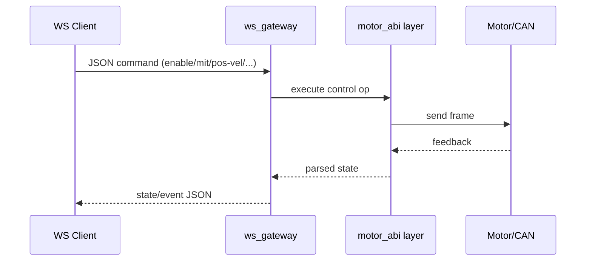

# ws_gateway

High-performance Rust WebSocket gateway (V1: JSON over WS).



## Status

Implemented.

## Transport

- Protocol: WebSocket
- V1 payload: JSON text frames
- Periodic state push on each `--dt-ms` tick

## Build

```bash
cargo build -p ws_gateway --release
```

## Run

```bash
cargo run -p ws_gateway --release -- \
  --bind 0.0.0.0:9002 --vendor damiao --channel can0 --model 4340P --motor-id 0x01 --feedback-id 0x11 --dt-ms 20
```

```bash
cargo run -p ws_gateway --release -- \
  --bind 0.0.0.0:9002 --vendor robstride --channel can0 --model rs-06 --motor-id 127 --feedback-id 0xFF --dt-ms 20
```

## Inbound command examples

```json
{"op":"ping"}
{"op":"enable"}
{"op":"disable"}
{"op":"set_target","vendor":"robstride","channel":"can0","model":"rs-06","motor_id":127,"feedback_id":255}
{"op":"mit","pos":0.0,"vel":0.0,"kp":20.0,"kd":1.0,"tau":0.0,"continuous":true}
{"op":"pos_vel","pos":3.1,"vlim":1.5,"continuous":true}
{"op":"vel","vel":0.5,"continuous":true}
{"op":"force_pos","pos":0.8,"vlim":2.0,"ratio":0.3,"continuous":true}
{"op":"stop"}
{"op":"state_once"}
{"op":"clear_error"}
{"op":"set_zero_position"}
{"op":"ensure_mode","mode":"mit","timeout_ms":1000}
{"op":"request_feedback"}
{"op":"store_parameters"}
{"op":"set_can_timeout_ms","timeout_ms":1000}
{"op":"write_register_u32","rid":10,"value":1}
{"op":"write_register_f32","rid":31,"value":5.0}
{"op":"get_register_u32","rid":7,"timeout_ms":1000}
{"op":"get_register_f32","rid":21,"timeout_ms":1000}
{"op":"robstride_ping","timeout_ms":200}
{"op":"robstride_read_param","param_id":28697,"type":"f32","timeout_ms":200}
{"op":"robstride_write_param","param_id":28682,"type":"f32","value":0.3,"verify":true}
{"op":"poll_feedback_once"}
{"op":"shutdown"}
{"op":"close_bus"}
{"op":"scan","start_id":1,"end_id":16,"feedback_base":16,"timeout_ms":100}
{"op":"scan","vendor":"robstride","start_id":120,"end_id":135,"feedback_ids":"0xFF,0xFE,0x00","timeout_ms":120}
{"op":"set_id","vendor":"damiao","old_motor_id":2,"old_feedback_id":18,"new_motor_id":5,"new_feedback_id":21,"store":true,"verify":true}
{"op":"set_id","vendor":"robstride","old_motor_id":127,"new_motor_id":126,"feedback_id":255,"verify":true}
{"op":"verify","motor_id":5,"feedback_id":21,"timeout_ms":1000}
{"op":"verify","vendor":"robstride","motor_id":127,"feedback_id":255,"timeout_ms":500}
```

## Outbound frames

Success response:

```json
{"ok":true,"op":"vel","data":{"op":"vel","continuous":true}}
```

Error response:

```json
{"ok":false,"op":"set_id","error":"..."}
```

State stream frame:

```json
{"type":"state","data":{"has_value":true,"pos":0.12,"vel":0.01,"torq":0.0,"status_code":1}}
```

## Notes

- `--vendor damiao|robstride` controls default target vendor.
- `set_target` can switch vendor/channel/model/id on the fly per session.
- `continuous=true` keeps sending that control command every tick.
- `stop` clears continuous control.
- `set_id` is vendor-aware:
  - Damiao: write `MST_ID` first, then `ESC_ID`.
  - RobStride: device ID update via `SET_DEVICE_ID`.
- Damiao-only ops: `pos_vel`, `force_pos`, `write/get_register_*`.
- RobStride-only ops: `robstride_ping`, `robstride_read_param`, `robstride_write_param`.
- V2 plan can switch to binary frames while preserving operation semantics.
