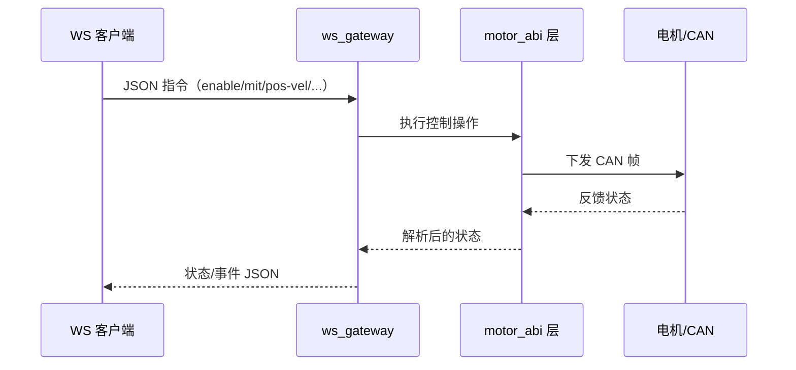

# ws_gateway

高性能 Rust WebSocket 网关（V1：JSON over WS）。



## 状态

已实现。

## 传输

- 协议：WebSocket
- V1 载荷：JSON 文本帧
- 按 `--dt-ms` 周期推送状态

## 构建

```bash
cargo build -p ws_gateway --release
```

## 运行

```bash
cargo run -p ws_gateway --release -- \
  --bind 0.0.0.0:9002 --channel can0 --model 4340P --motor-id 0x01 --feedback-id 0x11 --dt-ms 20
```

## 入站命令示例

```json
{"op":"ping"}
{"op":"enable"}
{"op":"disable"}
{"op":"mit","pos":0.0,"vel":0.0,"kp":20.0,"kd":1.0,"tau":0.0,"continuous":true}
{"op":"pos_vel","pos":3.1,"vlim":1.5,"continuous":true}
{"op":"vel","vel":0.5,"continuous":true}
{"op":"force_pos","pos":0.8,"vlim":2.0,"ratio":0.3,"continuous":true}
{"op":"stop"}
{"op":"state_once"}
{"op":"clear_error"}
{"op":"set_zero_position"}
{"op":"ensure_mode","mode":"mit","timeout_ms":1000}
{"op":"request_feedback"}
{"op":"store_parameters"}
{"op":"set_can_timeout_ms","timeout_ms":1000}
{"op":"write_register_u32","rid":10,"value":1}
{"op":"write_register_f32","rid":31,"value":5.0}
{"op":"get_register_u32","rid":7,"timeout_ms":1000}
{"op":"get_register_f32","rid":21,"timeout_ms":1000}
{"op":"poll_feedback_once"}
{"op":"shutdown"}
{"op":"close_bus"}
{"op":"set_target","channel":"can0","model":"4310","motor_id":2,"feedback_id":18}
{"op":"scan","start_id":1,"end_id":16,"feedback_base":16,"timeout_ms":100}
{"op":"set_id","old_motor_id":2,"old_feedback_id":18,"new_motor_id":5,"new_feedback_id":21,"store":true,"verify":true}
{"op":"verify","motor_id":5,"feedback_id":21,"timeout_ms":1000}
```

## 出站帧

成功响应：

```json
{"ok":true,"op":"vel","data":{"op":"vel","continuous":true}}
```

失败响应：

```json
{"ok":false,"op":"set_id","error":"..."}
```

状态流：

```json
{"type":"state","data":{"has_value":true,"pos":0.12,"vel":0.01,"torq":0.0,"status_code":1}}
```

## 说明

- `continuous=true` 会在每个 tick 持续发送该控制命令。
- `stop` 用于清除持续控制。
- `set_id` 使用稳定顺序：先写 `MST_ID`，再写 `ESC_ID`。
- V1 在命令层已覆盖 ABI 全部操作面。
- 后续 V2 可升级为二进制帧，同时保留同一语义。
