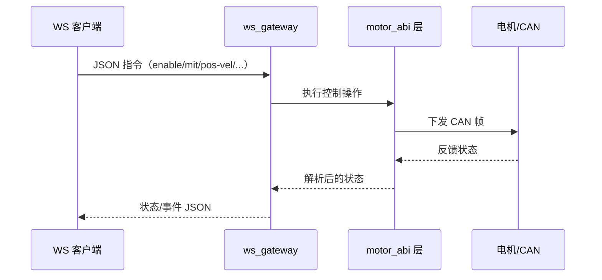

# ws_gateway

<!-- channel-compat-note -->
## 通道兼容说明（PCAN + slcan + Damiao 串口桥）

- Linux SocketCAN 直接使用网卡名：`can0`、`can1`、`slcan0`。
- 串口类 USB-CAN 需先创建并拉起 `slcan0`：`sudo slcand -o -c -s8 /dev/ttyUSB0 slcan0 && sudo ip link set slcan0 up`。
- 仅 Damiao 可选串口桥链路：`--transport dm-serial --serial-port /dev/ttyACM0 --serial-baud 921600`。
- Damiao 串口桥完整接口与命令模板见 `motor_cli/README.zh-CN.md` 第 `3.6` 节（英文见 `motor_cli/README.md`）。
- Linux SocketCAN 下 `--channel` 不要带 `@bitrate`（例如 `can0@1000000` 无效）。
- Windows（PCAN 后端）中，`can0/can1` 映射 `PCAN_USBBUS1/2`，可选 `@bitrate` 后缀。


高性能 Rust WebSocket 网关（V1：JSON over WS）。



## 状态

WS API 主链路已实现。
内置网页上位机（`tools/ws_test_client.html`）仍在持续开发中。

## 传输

- 协议：WebSocket
- V1 载荷：JSON 文本帧
- 按 `--dt-ms` 周期推送状态

## 统一模式映射（草案）

目标：应用层优先使用统一操作集；厂商专属操作保留可用，但不作为默认推荐路径。

### 统一控制模式（应用层，固定基线）

| 统一模式 | 统一操作 | 核心参数 |
| --- | --- | --- |
| `mit` | `{"op":"mit", ...}` | `pos`, `vel`, `kp`, `kd`, `tau` |
| `pos_vel` | `{"op":"pos_vel", ...}` | `pos`, `vlim` |
| `vel` | `{"op":"vel", ...}` | `vel` |
| `force_pos` | `{"op":"force_pos", ...}` | `pos`, `vlim`, `ratio` |

若某厂商不支持这四种基线模式，网关统一返回 `unsupported`。

### 厂商映射表（统一模式 -> 厂商原生）

| 厂商 | `mit` | `pos_vel` | `vel` | `force_pos` | 参数差异 | 备注 |
| --- | --- | --- | --- | --- | --- | --- |
| damiao | 原生 MIT | 原生 POS_VEL | 原生 VEL | 原生 FORCE_POS | 参数完整对齐 | 基线参考实现 |
| robstride | 原生 MIT | 不支持 | 原生 Velocity 模式 | 不支持 | `vel` 映射到 vendor velocity target | 参数读写走 `robstride_*` |
| hexfellow | 原生 MIT | 原生 POS_VEL | 不支持 | 不支持 | `mit` 支持 `kp/kd/tau`，无独立 `vel` | CAN-FD 链路 |
| myactuator | 不支持 | 不支持 | 原生速度设定 | 不支持 | 基线里仅 `vel` 可用 | 强项是 current/position/version/mode-query |
| hightorque | 原生 MIT（ht_can 映射） | 不支持 | 原生速度帧 | 不支持 | `mit/vel` 为原生帧映射；`kp/kd` 为统一签名保留但协议侧忽略 | 当前子集 scan/read/mit/vel/stop；`enable/disable` 接受但为 no-op |

### 统一核心操作支持矩阵

| 厂商 | `scan` | `set_id` | `enable` | `disable` | `stop` | `state_once/status` |
| --- | --- | --- | --- | --- | --- | --- |
| damiao | 支持 | 支持 | 支持 | 支持 | 支持 | 支持 |
| robstride | 支持 | 支持 | 支持 | 支持 | 支持 | 支持 |
| hexfellow | 支持 | 不支持 | 支持 | 支持 | 支持 | 支持 |
| myactuator | 支持 | 不支持 | 支持 | 支持 | 支持 | 支持 |
| hightorque | 支持 | 不支持 | 接受（no-op） | 接受（no-op） | 支持 | 支持 |

### 模式参数差异说明

- `mit`：统一字段一致，但各厂商内部缩放/编码不同，由网关适配层处理。
  HighTorque 细节：当前协议路径会忽略 `kp/kd`。
- `pos_vel`：仅对具备等价模式的厂商可用。
- `vel`：方向与量纲转换由厂商适配层内部处理。
- `force_pos`：当前统一路径仅 Damiao 支持。

## WS `capabilities` 响应结构（草案）

建议：客户端连接后先调用 `{"op":"capabilities"}`，根据返回能力矩阵自动适配 UI 与流程。

### 响应示例

```json
{
  "ok": true,
  "op": "capabilities",
  "data": {
    "api_version": "v1",
    "default_vendor": "damiao",
    "vendors": {
      "damiao": {
        "transports": ["auto", "socketcan", "socketcanfd", "dm-serial"],
        "modes": ["mit", "pos_vel", "vel", "force_pos"],
        "ops_unified": ["scan", "set_id", "enable", "disable", "stop", "state_once", "status", "verify"],
        "ops_vendor_native": ["write_register_u32", "write_register_f32", "get_register_u32", "get_register_f32"]
      },
      "robstride": {
        "transports": ["auto", "socketcan", "socketcanfd"],
        "modes": ["mit", "vel"],
        "ops_unified": ["scan", "set_id", "enable", "disable", "stop", "state_once", "status", "verify"],
        "ops_vendor_native": ["robstride_ping", "robstride_read_param", "robstride_write_param"]
      },
      "hexfellow": {
        "transports": ["auto", "socketcanfd"],
        "modes": ["mit", "pos_vel"],
        "ops_unified": ["scan", "enable", "disable", "stop", "state_once", "status", "verify"],
        "ops_vendor_native": []
      },
      "myactuator": {
        "transports": ["auto", "socketcan", "socketcanfd"],
        "modes": ["vel"],
        "ops_unified": ["scan", "enable", "disable", "stop", "state_once", "status", "verify"],
        "ops_vendor_native": ["status", "version", "mode-query"]
      },
      "hightorque": {
        "transports": ["auto", "socketcan"],
        "modes": ["mit", "vel"],
        "ops_unified": ["scan", "stop", "state_once", "status", "verify"],
        "ops_vendor_native": ["read"]
      }
    },
    "unsupported_behavior": "return {ok:false,error:'unsupported ...'}"
  }
}
```

## 构建

```bash
cargo build -p ws_gateway --release
```

## 运行

```bash
cargo run -p ws_gateway --release -- \
  --bind 0.0.0.0:9002 --vendor damiao --channel can0 --model 4340P --motor-id 0x01 --feedback-id 0x11 --dt-ms 20
```

```bash
cargo run -p ws_gateway --release -- \
  --bind 0.0.0.0:9002 --vendor robstride --channel can0 --model rs-06 --motor-id 127 --feedback-id 0xFF --dt-ms 20
```

## Windows 实验支持（PCAN-USB）

项目主线仍以 Linux 为主。Windows 支持为实验性能力，当前通过 PEAK PCAN 后端实现。

- 安装 PEAK 驱动与 PCAN-Basic 运行时（`PCANBasic.dll`）。
- Windows 启动网关时可使用 `can0@1000000`：

```bash
cargo run -p ws_gateway --release -- --bind 0.0.0.0:9002 --vendor damiao --channel can0@1000000 --model 4340P --motor-id 0x01 --feedback-id 0x11 --dt-ms 20
```

Windows 电机验证命令：

```bash
cargo run -p motor_cli --release -- --vendor damiao --channel can0@1000000 --model 4340P --motor-id 0x01 --feedback-id 0x11 --mode scan --start-id 1 --end-id 16
cargo run -p motor_cli --release -- --vendor damiao --channel can0@1000000 --model 4340P --motor-id 0x01 --feedback-id 0x11 --mode pos-vel --pos 3.1416 --vlim 2.0 --loop 1 --dt-ms 20
cargo run -p motor_cli --release -- --vendor damiao --channel can0@1000000 --model 4310 --motor-id 0x07 --feedback-id 0x17 --mode pos-vel --pos 3.1416 --vlim 2.0 --loop 1 --dt-ms 20
```

## 入站命令示例

```json
{"op":"ping"}
{"op":"enable"}
{"op":"disable"}
{"op":"set_target","vendor":"robstride","channel":"can0","model":"rs-06","motor_id":127,"feedback_id":255}
{"op":"mit","pos":0.0,"vel":0.0,"kp":20.0,"kd":1.0,"tau":0.0,"continuous":true}
{"op":"pos_vel","pos":3.1,"vlim":1.5,"continuous":true}
{"op":"vel","vel":0.5,"continuous":true}
{"op":"force_pos","pos":0.8,"vlim":2.0,"ratio":0.3,"continuous":true}
{"op":"stop"}
{"op":"state_once"}
{"op":"clear_error"}
{"op":"set_zero_position"}
{"op":"ensure_mode","mode":"mit","timeout_ms":1000}
{"op":"request_feedback"}
{"op":"store_parameters"}
{"op":"set_can_timeout_ms","timeout_ms":1000}
{"op":"write_register_u32","rid":10,"value":1}
{"op":"write_register_f32","rid":31,"value":5.0}
{"op":"get_register_u32","rid":7,"timeout_ms":1000}
{"op":"get_register_f32","rid":21,"timeout_ms":1000}
{"op":"robstride_ping","timeout_ms":200}
{"op":"robstride_read_param","param_id":28697,"type":"f32","timeout_ms":200}
{"op":"robstride_write_param","param_id":28682,"type":"f32","value":0.3,"verify":true}
{"op":"poll_feedback_once"}
{"op":"shutdown"}
{"op":"close_bus"}
{"op":"scan","start_id":1,"end_id":16,"feedback_base":16,"timeout_ms":100}
{"op":"scan","vendor":"robstride","start_id":120,"end_id":135,"feedback_ids":"0xFF,0xFE,0x00","timeout_ms":120}
{"op":"set_id","vendor":"damiao","old_motor_id":2,"old_feedback_id":18,"new_motor_id":5,"new_feedback_id":21,"store":true,"verify":true}
{"op":"set_id","vendor":"robstride","old_motor_id":127,"new_motor_id":126,"feedback_id":255,"verify":true}
{"op":"verify","motor_id":5,"feedback_id":21,"timeout_ms":1000}
{"op":"verify","vendor":"robstride","motor_id":127,"feedback_id":255,"timeout_ms":500}
```

## 出站帧

成功响应：

```json
{"ok":true,"op":"vel","data":{"op":"vel","continuous":true}}
```

失败响应：

```json
{"ok":false,"op":"set_id","error":"..."}
```

状态流：

```json
{"type":"state","data":{"has_value":true,"pos":0.12,"vel":0.01,"torq":0.0,"status_code":1}}
```

## 说明

- `--vendor damiao|robstride|hexfellow|myactuator|hightorque` 用于设置会话默认厂商。
- `set_target` 可在单个会话中动态切换厂商/transport/通道/串口/型号/ID。
- `continuous=true` 会在每个 tick 持续发送该控制命令。
- `stop` 用于清除持续控制。
- `set_id` 按厂商处理：
  - Damiao：先写 `MST_ID`，再写 `ESC_ID`。
  - RobStride：使用 `SET_DEVICE_ID` 更新设备 ID。
- Damiao 专属操作：`write/get_register_*` 与 `dm-serial` transport。
- RobStride 专属操作：`robstride_ping`、`robstride_read_param`、`robstride_write_param`。
- MyActuator 专属操作：`current`、`pos`、`version`、`mode-query`。
- HighTorque 专属操作：`read`。
- 后续 V2 可升级为二进制帧，同时保留同一语义。

## 简易上位机（快速联调）

- 文件：`integrations/ws_gateway/tools/ws_test_client.html`
- 四电机同步专用示例：`examples/web/ws_quad_sync_hmi.html`
- 直接浏览器打开（双击或 `xdg-open`），连接 `ws://127.0.0.1:9002`。
- 当前状态：**开发中**（界面与交互会持续调整）。
- 若要稳定联调，建议优先使用 JSON 直连客户端（wscat/websocat/自定义客户端）。
- 动态设备工作流：
  - 同一页面扫描 Damiao 与 RobStride
  - 扫描结果进设备表（vendor + motor_id + feedback_id + model）
  - 可选择任意扫描到的设备作为当前目标，执行使能/失能/速度/MIT
  - 支持勾选批量操作：批量使能/停转/失能、批量 MIT 同步到角度
- 四电机同角度拖杆控制建议用本地静态服务打开：
  - `python3 -m http.server 18080`
  - 浏览器访问 `http://127.0.0.1:18080/examples/web/ws_quad_sync_hmi.html`
